# PNU-bean-count-night

- PNU Mini Kaggle Competition(콩세는 밤)

    👉 input: 콩이 담겨져 있는 사진(동서남북, 위)   
    👉 output: 담겨져 있는 콩의 개수

    👉 21년도 대회 회고  
    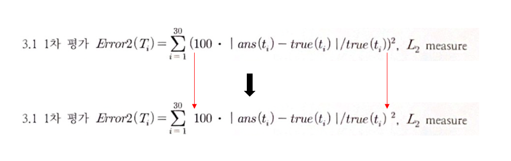
    - error 식을 잘못 세워 피팅 방향성을 잘못 잡았다. 
        - 잘못된 식으로 오차를 계산했을 때, 나온 에러값이 백의 자리 수였기 때문에, 이에 만족하고 알고리즘 개선보다는 보기 좋은 코드로 적는 것을 우선시하여 만족하지 못하는 결과를 얻었다.
    - 잘못된 수식으로 접근했어도 결론적으로는 제안하는 알고리즘 상에서는 가장 낮은 Error값들을 나타냈다.  

    👉 result    
    - Error1(square): 76660.25443252905  
    - Error2        : 1022.9702061451912  
    - time          : 8sec   

------- 

- team PongPongLab
    - [성강(skyriver)](https://github.com/skyriver228)
    - [송주현(izen1231)](https://github.com/izen1231)

---------
## 목차
1. [환경](#1-환경)
2. [파일 구조](#2-파일-구조)
3. [Algorithm Flow](#3-Algorithm-Flow)
4. [고찰](#4-고찰)
-----------
## 1. 환경
👉 OS : Windows 10  
👉 python 3.9.0

### 1.1. 사용 라이브러리
👉 requirements.txt 참조  
<pre>
<code>matplotlib==3.4.0  
numpy==1.20.3  
opencv-python==3.4.15.55  
scipy==1.7.3  
</code></pre>

### 1.2. 제한
👉 local data : under 10MB  
👉 no internet usage       

----------
## 2. 파일 구조
<pre>
<code>
├── Hidden: test data          
│       └── t00   
│             └── 1~4.jpg : 동서남북 방향
│             └── 5.jpg : 위 방향
├── Open: train data          
│       └── t00   
│             └── 1~4.jpg : 동서남북 방향
│             └── 5.jpg : 위 방향
├── main.ipynb: main.py를 읽기 쉽게 풀어작성한 보고서
├── main.html: main.ipynb의 html file
└── PongPongLab(01)         
        ├── Out  
        │     └── Kong_01.txt : Output data
        └── System
              ├── data : Hidden, Open의 label .txt data
              ├── idea : main.py를 작성하기 위해 겪은 모든 코드들의 조각
              ├── competition_main.py: 대회에 제출한 최종 코드
              └── main.py: 객체화 진행한 코드
</code></pre>
----------
## 3. Algorithm Flow
### 3.1. Preprocessing
- rgb 데이터는 사용하기에 너무 무거우며, 현재 대회에서는 CNN과 같은 부분의 사용이 하드웨어 리소스, 사용가능 라이브러리면에서 제한적이므로 전처리 과정을 통해 필요한 부분만을 가져온다. 
> BeanCount.getArea(self, image_path_list: List[str]) -> image_pixel_count_list: List[int]
- 전체적인 전처리 과정을 통한 결과물은 아래와 같다. 
    1. rgb img
    2. binary img
    3. area data
    4. counted data
#### 3.1.1. Get target img
> BeanCount.getAboveTargetImg(self, src:np.2darray) -> dst: np.2darray   
> BeanCount.getSideTargetImg(self, src:np.2darray) -> dst: np.2darray 

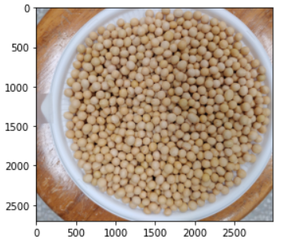
- 모든 부분을 사용할 필요는 없으며, 외부에 보이는 환경에 "원"으로 볼 수 있는 요소가 있으므로 필요부분(target)만을 잘라내 준다. 
- 단, 본 대회에서는 1~4.jpg는 동서남북에서 바라본 사진이고, 5.jpg는 위에서 바라본 사진이기 때문에 잘라내야 하는 부분이 달라서 다르게 처리했다. 
    - getSideTargetImg
        - 1~4.jpg
    - getAboveTargetImg
        - 5.jpg

#### 3.1.2. RGB2Binary
- 크게 2가지 방법을 고민했다.   
    👉 edge detection 기반의 원 추출  
    👉 hsv field를 사용한 콩의 영역 추출

- 하지만 2~1600개까지의 제한이 있는 본 대회에서 겹쳐진 부분에 대한 콩(원) 추출이 잘 되지 않았으며, 독립적이다고 보기에는 문제가 있었기 때문에 더 강력한 성능을 보인 "hsv field를 사용한 콩의 영역 추출 방법"을 사용하였다.

👉 hsv field를 사용한 콩의 영역 추출
> BeanCount.hsvRGB2Binary(self, src: np.2darray) -> dst: np.2darray  

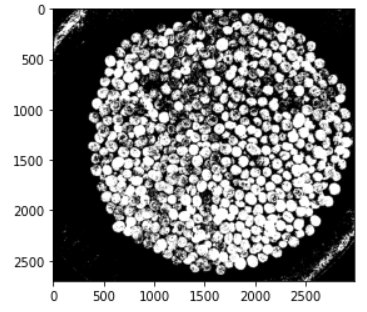
- hsv를 활용하여 rgb → binary 를 진행한다. 

#### 3.1.3. Erasing Noise
>BeanCount.erasingNoise(self, src: np.2darray) -> fg: np.2darray  

- 2단계로 나누어서 접근
했다.   
    👉 morphology  
    👉 image segmatation  

👉 morphology    

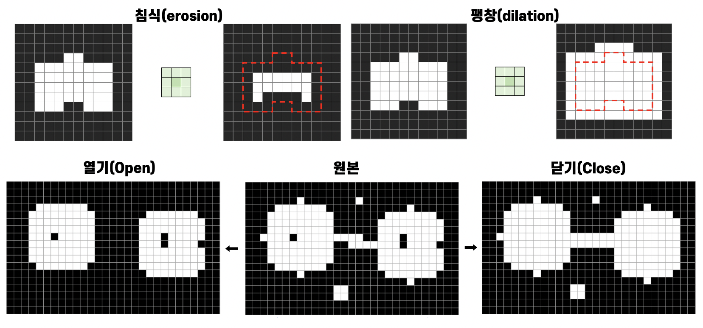  

- 영상을 형태학적인 측면에서 다루는 방법이다.
- 열기(Opening) 연산: 침식(Erosion) → 팽창(Dilation) 으로 노이즈를 제거한다.  
    - 작은 돌기,작은 객체가 사라지고 얇은 연결선이 끊어진다.  
 

👉 image segmentation 
- [refer link](https://www.askpython.com/python/examples/image-segmentation)
- 단계는 아래와 같다.
    1. closing(morphology)
        - 위에서 진행한 open morphology와 반대로 팽창(Dilation) → 침식(Erosion)으로 진행한다. 
        - 작은 홈, 구멍이 사라지고, 얇은 연결선이 두꺼워 짐
    2. dilate(morphology)
        - 마찬가지로 morphology 연산
        - 구조 요소와 객체 영역이 한 픽셀이라도 만날 경우 고정점 픽셀을 255 로 설정
        - 팽창 연산은 객체 외곽을 확대시키는 연산 
        - 객체 크기는 감소 & 배경은 확대
    3. distanceTransform
        - binary image에서 픽셀값이 0인 배경으로부터의 거리를 픽셀값이 255인 영역에 표시하는 방법 
        - 배경으로부터 멀리 떨어져 있을수록 높은 픽셀값을 가진다.
    4. threshold
        - 설정 threshold를 기준으로 binary화 시킨다.

#### 3.1.4. get area
> sum(sum(fg))
- 최종적으로 noise가 지워진 nd.2darray(binary image)의 sum을 구하면 되므로 따로 함수화 하지 않고 getArea에서 구현했다.

#### 3.1.5. grabcut
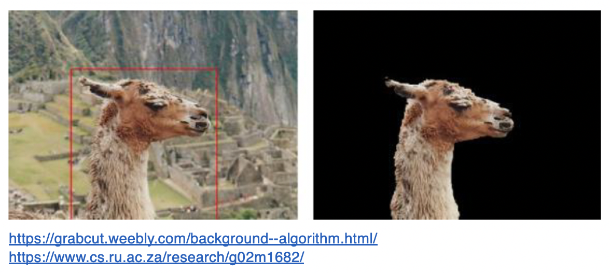
- 구현했다가 시간 제한때문에 사용하지 못한 코드이자 기법이다. 
- 그래프 컷 (graph cut) 기반 영역 분할 알고리즘
- 영상의 픽셀을 그래프 정점으로 간주하고
픽셀들을 두 개의 그룹으로 나누는 최적의
컷 (Max Flow Minimum Cut) 을 찾는 방식  

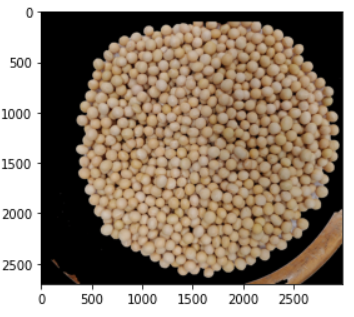
- 시간이 조금만 더 있었다면 이 알고리즘에 대한 추가적인 공부를 통해 vanila의 관점에서 접근하여 제한 시간 내로 output이 나올 수 있도록 tunning 했었으면 하는 바램이 있었다. 

### 3.2. Building Model
> BeanCount.fittingModel(self, x, y) -> linear_model_fn: tuple
- np.polyfit을 활용하여 counted area data와 labeled data를 regression으로 접근한다.

### 3.4. Running && Evaluate Model
#### 3.4.1. Running Model
> BeanCount.modelResult(self)
- Hidden data를 같은 방법으로 preprcessing을 진행하고 그 결과를 model에 넣어 결과물을 얻는다. 
> self.count_res
- 결과물을 self.count_res에 저장된다. 
#### 3.4.2. Evaluate Model
> BeanCount.getErrorRate(self)  
- self.count_res에 저장된 값과 실제 Hidden data의 결과값과 비교한다. 
- 이론으로 맞춰서 한 결과
    - 1,2,3,4.jpg → getSideTargetImg
    - 5.jpg → getAboveTargetImg  

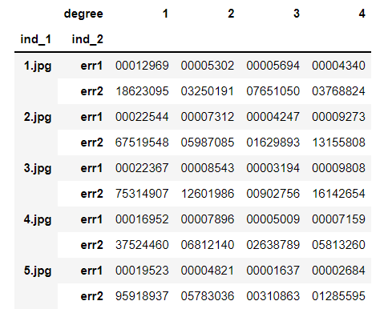

- 5.jpg → getSideTargetImg한 결과(특이했던 부분)
 
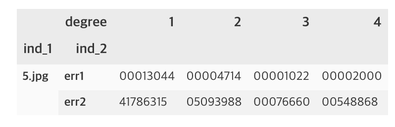

- 수식은 아래와 같다.  

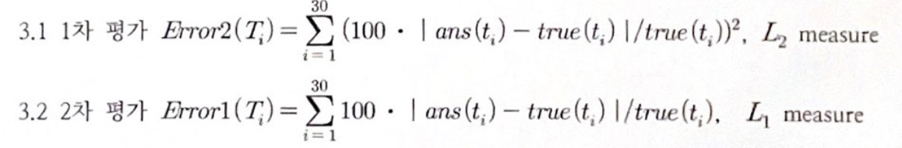

## 4. 고찰
### 4.1. 아쉬운 점
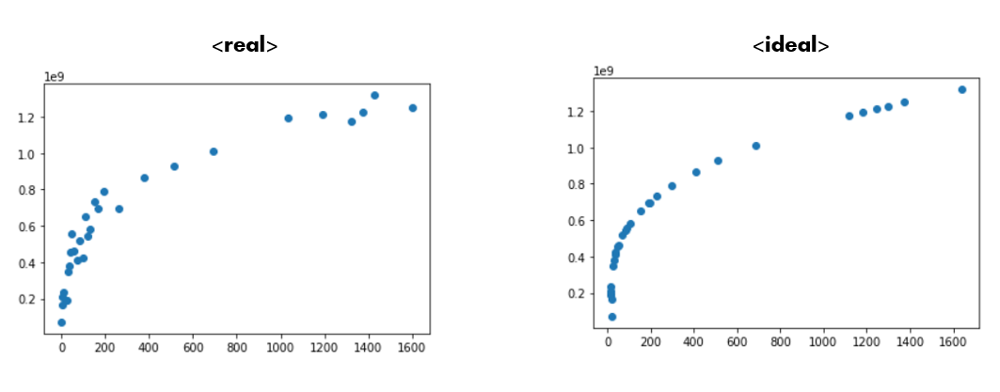
- 위와 같은 형태로 피팅되었기 때문에 잘못된 error 식이 잘못되었다고 생각하지 못하고 대회를 진행했다. 
    - 물론 이렇게 접근한 결과값이 본 알고리즘 flow로 접근했을 때, 가장 작은 데이터 값이었다.  

-  원하는 수준의 결과를 얻지는 못했다.나오지는 않았다.   
    👉 result    
    - Error1(square): 76660.25443252905  
    - Error2        : 1022.9702061451912  
    - time          : 8sec  

### 4.2. 고려할 점과 신기했던 점

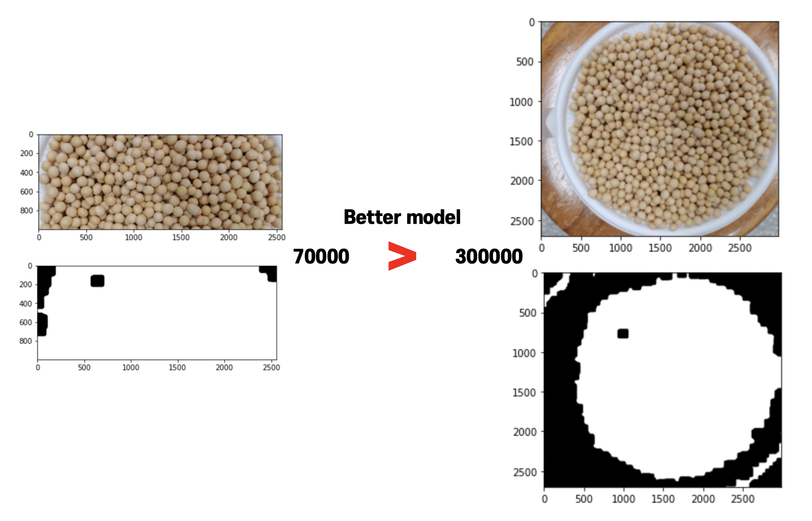  

- 이론대로 접근한 가설과는 다르게, getAboveArea에 해당하는 부분을 getSideArea로 접근하여 5.jpg를 접근했을 때, 가장 적은 값이 나온 것을 확인할 수 있었다.  
    - 그 이유로는 오른쪽에서 진행한 이론대로(5.jpg → getAboveTargetImg)했을 때, 접시가 놓여져 있는 의자의 색깔이 콩이랑 비슷하여 영향을 많이 준것이 아닌가라는 생각을 하게 되었다. 
   
- 또한 위의 결과 때문에, 우리가 하고 있는 부분이 결국 CNN과 같은 부분이 아닌가라는 생각을 하게 되었다.
    - 이론상 타당한 타겟 부분은 getAboveArea에서 선언한 부분이지만, getSideArea로 접근했을 때, 본 알고리즘 flow에서는 더욱 높은 정확도를 보였기 때문이다.
    -  변수가 많은 상황에서는 물론 이론상으로 접근하는 방법도 필요하지만, 데이터 상으로 접근하는 것의 비중을 높여야 하는 필요성을 느낄 수 있었다.
    - 그런 점에서 데이터 적인 관점에서 접근하는 최적의 filter weght를 찾아내는 CNN이 큰 강점을 가질 수 있을 것이라 예상한다.

  
- [출처](http://taewan.kim/post/cnn/)
- hsv field로 접근해 그에 알맞은 range를 찾는 과정이라던가, noise제거 filter의 적당 크기를 찾는 것을 사람의 손으로 일일이 찾는 것은 현실적으로 무리가 있다. 이 부분을 적합한 loss fuction을 가지고 역전파 기법을 통해 빠른 최적화가 가능한 CNN으로 접근하는 것이 타당하다.
    - 즉, 현재 우리가 접근한 방식이 결국은 CNN에서 convolution filter weight를 정하는 과정이라는 생각이 들었다. 
    - 원하는 구역만을 추출하고, 각 픽셀에 알맞은 weight를 주고 threshold를 기준으로 binary image로 처리하고 regression하는 과정으로 단순화해서 생각할 수 있기 때문이다. 

### 4.3. 발전 방향성

- 문득, fitting에 다항함수밖에 가능하다면, 그냥 x에 np.log를 씌워서도 접근하면 좋을것 같다는 생각이 들었다.
- 현재는 사용할 수 있는 라이브러리와 시간이 한정적이었기 때문에 하나의 값을 가지고 회귀를 진행했지만, 독립성 검사를 한 후에 다중 회귀 문제로도 접근해보고 싶다. 
- grabcut을 vanila 수준으로 접근해 뜯어내서 더욱 빠른 속도로 해당 알고리즘을 돌릴 수 없을까에 대한 고찰도 필요할 것이라 생각 
- 마찬가지로 주어진 library만을 가지고 CNN을 직접하나하나 짜보는 것도 다음에는 가능할 정도로 실력을 키우고 싶다.

- 마지막으로, 개인적으로 도전과제였던 객체화 부분은 나름대로 진행하기는 하였지만, 아직 부족한 부분이 많은 것 같다. 더 나은 방향으로 꾸준히 update하도록 하겠다.
